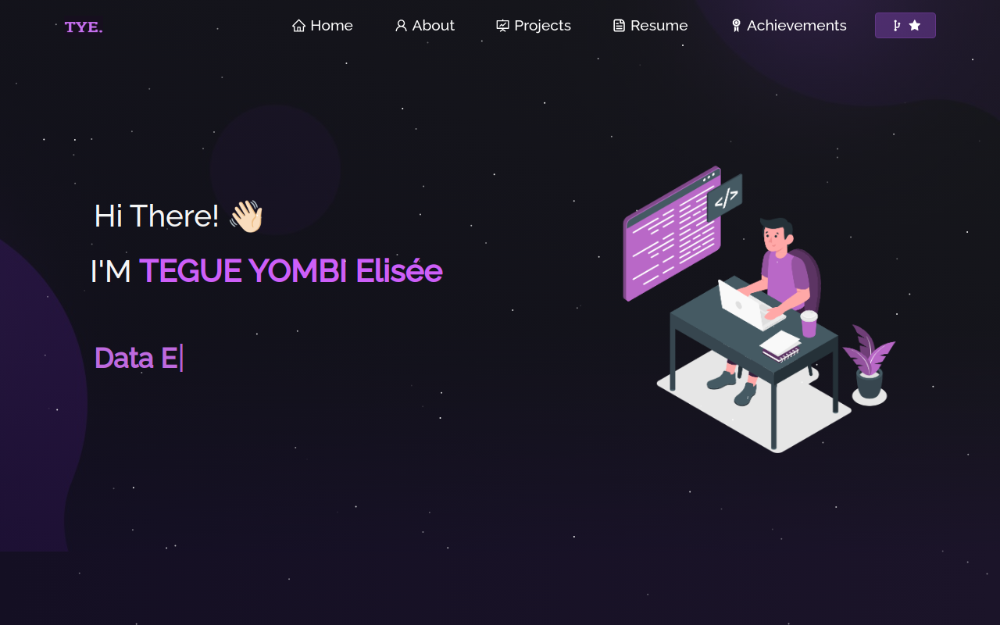

<h2 align="center">
  My Portfolio Website 
  <a href="https://eliseetegue.vercel.app/" target="_blank">eliseetegue.me</a>
</h2>

  

 

 &nbsp;
 &nbsp;
 &nbsp;
 &nbsp;

<h3 align="center">
    🔹
    <a href="https://github.com/el-tegy/portfolio/issues">Report Bug</a> &nbsp; &nbsp;
    🔹
    <a href="https://github.com/el-tegy/portfolio/issues">Request Feature</a>
</h3>

## Built With

My personal portfolio <a href="https://eliseetegue.vercel.app/" target="_blank">elisee.me</a> which features some of my github projects as well as my resume and technical skills. 

This project was built using these technologies.

- React.js
- Node.js
- Express.js
- CSS3
- VsCode
- Vercel

## Features

**📖 Multi-Page Layout**

**🎨 Styled with React-Bootstrap and Css with easy to customize colors**

**📱 Fully Responsive**

## Credits

Soumyajit repo at [Soumyajit4419](https://github.com/soumyajit4419/Portfolio).

## Show your support

Give a ⭐ if you like this website!
